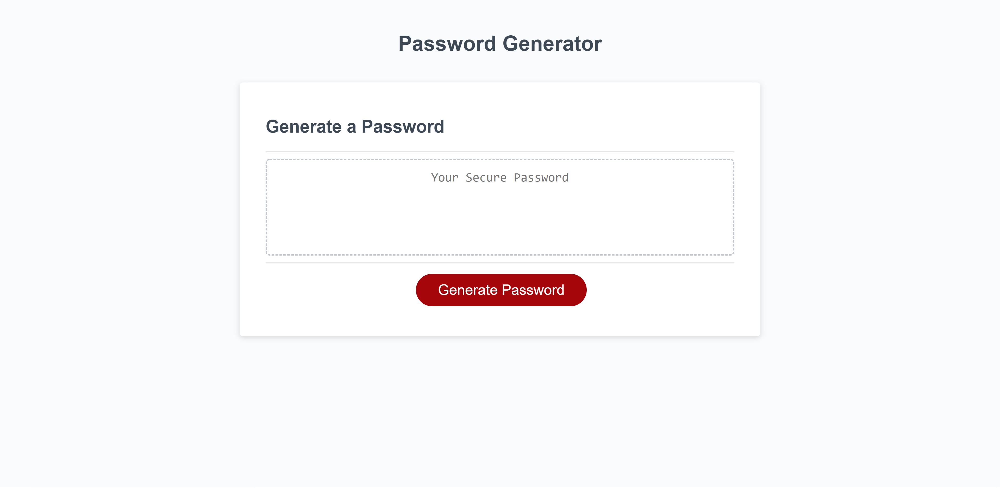

# Password Generator

I created a random password generator. The user is asked to define the length of the their password between 8 and 128 characters. Once that has been defined they can choose to have upper case, lower case, numbers or special characters included in their password. If they choose to have all four, all four types of characters will be reflected in their password.

## Code Snippet of Password Randomizer
```var passwordOutput = ""
passwordOutput += passwordOutput.concat(finalRandom)
for(i=0; i < inputLength-finalRandom.length; i++) { //inputlength subtracing finalRandom array to make first 4 be ensured
  var randomizer = Math.floor(Math.random() * finalPassword.length);
    passwordOutput += finalPassword[randomizer];
  }
  return passwordOutput;
}//writing the function
function writePassword() {    
  var password = generatePassword();
  var passwordText = document.querySelector("#password");
  
  passwordText.value = password;
}
  ```

## Screenshot



## Built With

* [HTML](https://developer.mozilla.org/en-US/docs/Web/HTML)
* [CSS](https://developer.mozilla.org/en-US/docs/Web/CSS)
* [Javascript](https://developer.mozilla.org/en-US/docs/Web/JavaScript)

## Deployed Link

* [See Live Site](https://perfectoment.github.io/password-generator/)


## Author

* **Ryan Nemec** 

- [Link to Portfolio Site](https://perfectoment.github.io/Ryan-Portfolio/)
- [Link to Github](https://github.com/perfectoment)
- [Link to LinkedIn](https://www.linkedin.com/in/ryan-nemec-5a6b3a66/)


## License

This project is licensed under the MIT License 

